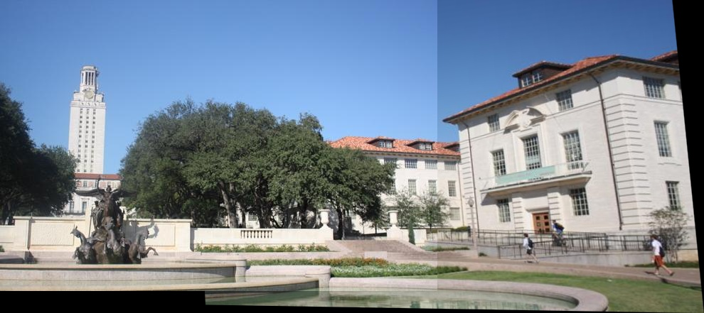
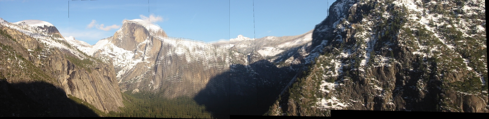
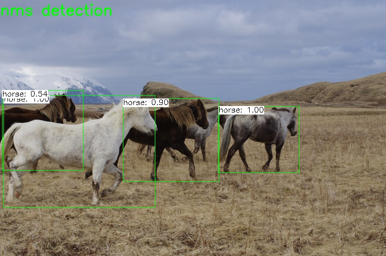

# OpenCV Demo
A list of OpenCV demos

## Libraries

* OpenCV3.4.5 and contrib
* Boost(1.68).filesystem

## Stitch

 A demo demonstrates how to use feature detector, find transform matrix , warp img, and stitch together.
   
 usage: ./stitch img0.jpg img1.jpg img2.jpg..., note img should be ordered from left to right.
 
 

##  SiftGPUStitch

 A demo just like Stitch, but use [SiftGPU](https://github.com/pitzer/SiftGPU.git) to extract features. SiftGPU is A GPU implementation of David Lowe's Scale Invariant Feature Transform, writeen by Changchang wu. 
 
 
 ## Tracker 
 
This demo demostrates how to track object. We assemble opencv trackers and Staple tracker. Type `./track help` for more information.

 

Supported algorithm list as below:
* Boosting, OpenCV
* KCF, OpenCV
* MIL, OpenCV
* TLD, OpenCV
* MedianFlow, OpenCV
* GOTURN, OpenCV
* MOSSE, OpenCV
* Staple, copy src from [github](https://github.com/xuduo35/STAPLE), written by xuduo35.

## Detection

Use OpenCV DNN module to do yolov3 object detect.

Please download yolov3 cfg file, class name and weight file for cnn forward.Type `./detection help` for more infomation.

## hog

Use OpenCV HOGDescriptor and visualize.

